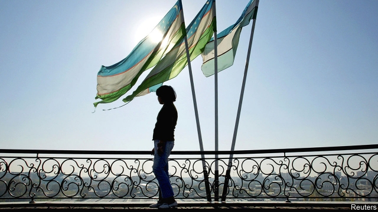

###### The most democratic ever

# Uzbekistan holds a semi-serious election 

 

> print-edition iconPrint edition | Asia | Dec 18th 2019 

FOR THE past 100 years, first under communism, then under an exceptionally vicious dictatorship, Uzbekistan’s parliament has been toothless, always pandering to the man in charge—in Moscow or, since independence in 1991, in Tashkent, the Central Asian state’s capital. But as Uzbeks go to the polls on December 22nd, Bobur Bekmurodov, a candidate who has been running a government-backed movement to promote reform, says it is time for the parliament to “grow teeth”. If he wins a seat, he says, he will try to make local government more accountable and let civil society breathe more freely. That is fighting talk in a country that long trembled under the lash of Islam Karimov, who, after serving the Kremlin loyally for many years, tyrannised the independent country until his death in 2016. Since then his successor, Shavkat Mirziyoyev, has astonished and delighted his citizens with his enthusiasm for reform. The question now is how far and how fast he will dare to go. 

Mr Mirziyoyev’s reforms have so far centred on the economy, which he has set about liberalising with gusto. The main political change to date has been to lock up far fewer people for their opinions, although life remains difficult for some journalists and bloggers. Mr Bekmurodov, who is 34, would “absolutely not” have stood for parliament in the old days, but sees an opportunity for change. He is not, however, a member of an opposition party, because no such thing yet exists in this country of 33m people, and independents are barred from standing. Mr Bekmurodov is on the ticket of the Uzbekistan Liberal Democratic Party, the outgoing parliament’s largest force and the closest thing Uzbekistan has to a ruling party. Mr Mirziyoyev, supposedly above the political fray, says he supports no candidates and no party. 

The other four parties that are taking part in the election espouse minor variations on the government’s themes. None of them truly criticises the powers that be. The People’s Democratic Party of Uzbekistan, the Justice Social Democratic Party and the National Revival Democratic Party advocate improved social welfare for various groups. The Ecological Party backs government plans to build a nuclear power station. Voters on the streets of Tashkent have little idea of what these parties really stand for. One market trader says he will tick the People’s Democratic Party on his ballot paper because he likes the word “people” in the name. 

The government is depicting the election, the first national ballot since Mr Mirziyoyev won the presidency three years ago with an implausible 89% of the vote, as Uzbekistan’s most vibrant and competitive ever. That is true, but the previous, sham elections set an extremely low bar and the absence of any opposition parties remains a glaring flaw. Officials insist Uzbekistan is democratising, but in a manner more evolutionary than revolutionary. It has passed a new election law, which monitors from the Organisation for Security and Co-operation in Europe say follows some recommendations to improve the administration of the ballot, but ignores others pertaining to “fundamental freedoms”. 

The campaign featured live television debates which, although staid, subjected candidates to a new level of scrutiny. Parties have been wooing voters more vigorously than in the past, even though their rhetoric is “superficial and artificial”, according to Nazima Davletova, a civic activist, and “their programmes are basically the same.” Some have voiced timid criticism of officialdom. After hospitals in his constituency lost power 50 times in three days, Mr Bekmurodov took to social media to complain. 

Mr Mirziyoyev enjoys popularity for bringing change after 25 years of stagnation, but recent protests over energy shortages reflect disillusionment with the state of basic public services. Double-digit inflation is another gripe. Commentators on social media lampooned the leader of the Liberal Democratic Party after he blamed a 20% rise in meat prices this year on Uzbeks’ insatiable appetites. Mr Mirziyoyev has loosened the screws on the press, whose coverage of the campaign has been livelier than before, though there are red lines: criticising the president remains a no-no. 

Dilfuza Kurolova, a human-rights lawyer, harbours cautious optimism that the new parliament can be more “impactful”. Many voters are more sceptical. “The parties do nothing for us,” says a health worker dismissively. Mr Mirziyoyev has ordered parliamentarians to spend more time with their constituents to get a better sense of their concerns, and claims to desire a more robust debate in parliament. He has beefed up its limited powers to call ministers to account, although the mood remains more consensual than confrontational. 

“We are not an enemy to the government,” says Eldor Tulyakov, an MP in the outgoing parliament from the National Revival Party, but “we do criticise.” He believes the greater freedom of expression Uzbeks enjoy under Mr Mirziyoyev will eventually lead to the emergence of a proper political opposition. Even the optimistic Ms Kurolova has her doubts about that. Although there are technically no legal impediments, she says, “we don’t have much freedom to create political parties.” 

For all Mr Mirziyoyev’s talk of transforming parliament into a “true school of democracy”, there is little proof he is willing to tolerate genuine opposition. Then again, says Mr Bekmurodov, a great deal has changed in the president’s three years in power: “I’ve learned not to rule anything out, because a great deal that seemed impossible to us is now reality.” ■ 

