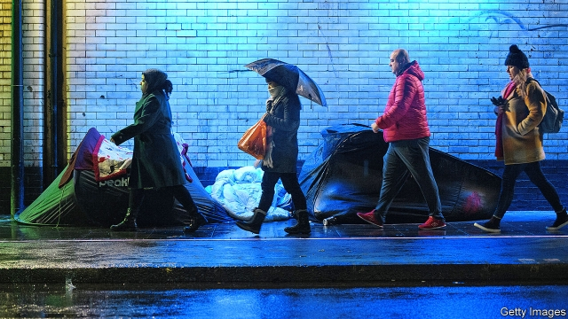
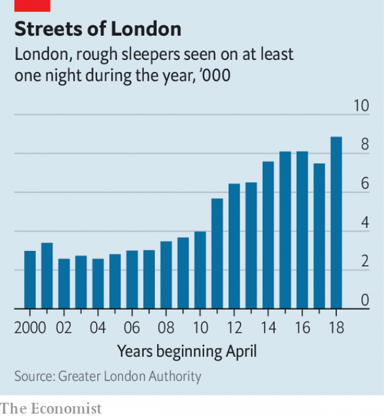

###### No crib for a bed

# On any one winter night, around 5,000 people in Britain sleep rough 

 

> print-edition iconPrint edition | Britain | Dec 18th 2019 

VERY DIFFERENT journeys have brought the guests at the Soup Kitchen on London’s Tottenham Court Road together. Craig, a 34-year-old decorator from Swansea, was left by his wife, sold his house and spent the money on crack so that she couldn’t get her hands on it. Nick, a 37-year-old from Grimsby, ran away from his debts. Deyan, a 40-year-old from Bulgaria, with a master’s in economics, has struggled to find work in London that covers the rent. Paul, a 53-year-old also from Swansea, travels around looking for work. 

Most are sleeping rough, either full-time or intermittently. Their attitudes to this vary. Craig celebrates it: “If you don’t have anything, you have total freedom. That’s something you can’t buy.” Nick longs to return to Grimsby to see his son, the thought of whom makes him tear up. But first he would have to pay his debts, for which he would have to get a job, for which he needs access to his bank account, for which he needs to pay off his debts. Paul seems resigned, but regards Craig’s view as “very naive: the street is a chaotic place. Violence can come out of nowhere.” 

Mortality statistics support that idea. In 2018, an estimated 724 homeless people under the age of 75 died, most of whom were sleeping rough or in shelters. The average age is 45. The number of deaths has increased by half since 2013. 

According to Crisis, a charity, around 170,000 households are homeless. That includes sofa-surfers and people in hostels. Less than a tenth are regular rough sleepers. Numbers fell in the first decade of this century, thanks to a Labour government’s efforts to deal with the problem, but have increased sharply over the past ten years. 

Rough sleeping is a complex problem, in that it is associated with relationship breakdown and addiction. But it is also a simple one, in that the main driver is the cost and availability of housing. In 2011 housing benefit was cut from half of average local rents to 30%. For people in London, income reductions were particularly sharp. According to Thiemo Fetzer, Srinjoy Sen and Pedro Souza of Warwick University, in Camden the average loss to households was £1,924 ($2,530) a year. 

With a continued net decline in social rented housing, privately rented accommodation covered in part by housing benefit is the main source of subsidised housing these days, so the cut in housing benefit had a big impact. Crisis says that evictions from the private rented sector were the main reason for the increase in homelessness in 2010-18. The savings to the public sector were minimal: lower spending on housing benefit by central government was mostly offset by higher spending by councils on shelters and suchlike. 

A new law designed to bring numbers down that came into force last year required councils to take “reasonable steps” to help all homeless people. That may be why numbers across the country dipped last year, though campaigners point out that “reasonable steps” can be interpreted as giving rough sleepers a list of hostels. The decline may also be to do with localised efforts such as that in Manchester, which is trialling a version of the Housing First policy that has worked in Finland (see article). Rough-sleeping numbers in Manchester are down by 37% this year. 

 

But in London, numbers continue to rise (see chart), and not only among Britons: the fastest-growing group is from eastern Europe. They now make up nearly half of rough sleepers in Westminster, the borough with the biggest problem. It has “ample accommodation” for them, says Ian Adams, the councillor responsible, but since housing benefit was withdrawn from unemployed European migrants in 2014, the government will not pay their bills, and since a High Court decision in 2017 they cannot be deported for sleeping rough. “It’s really frustrating,” says Mr Adams. “We have our hands tied behind our backs.” 

With London’s streets awash with rain, the city’s rough sleepers look like having a dank Christmas. But some look on the bright side. Paul stopped drinking 30 years ago and has managed to stay sober by going to Alcoholics Anonymous at 7.30am most days. “I just have to walk past some people on the streets, off their heads on drink or drugs, and I think how lucky I am.” ■ 

