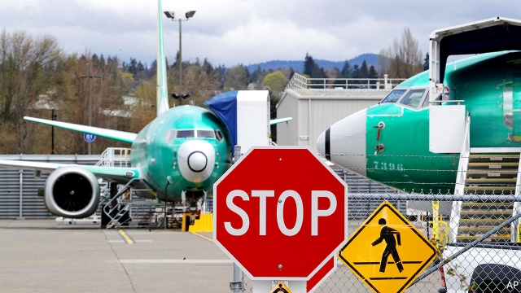
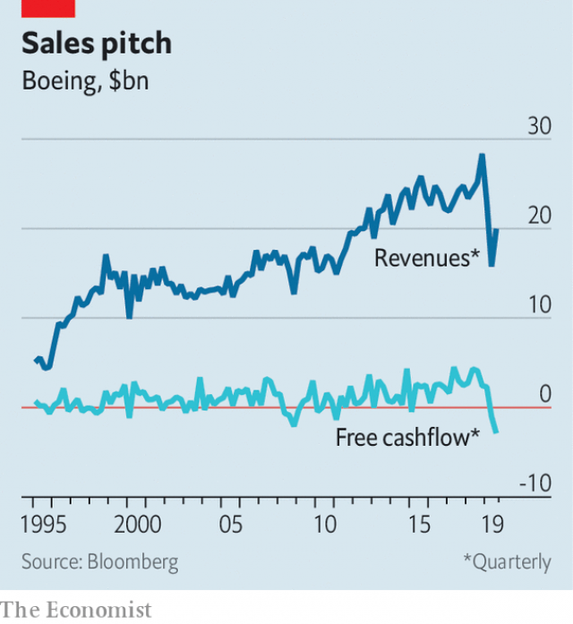

###### Boeing going wrong

# Boeing will halt production of its troubled 737 MAX 

 

> print-edition iconPrint edition | Business | Dec 18th 2019 

COMMERCIAL AVIATION makes up the bulk of Boeing’s revenues. Military-minded top brass of its large defence arm would be excused for seeing that business as a case study in tactical and strategic failure. After two crashes of its 737 MAX airliners, which killed 346 people and were linked to a defective flight-software system, the bestselling model was grounded around the world in March. Yet Boeing continued to make the plane even though it could no longer deliver new ones to customers. Now it is in retreat. On December 16th, with around 800 new and used flightless jets lying idle, the firm decided to halt production in January until the MAX is permitted back in the air. The upheaval may at last force a rethink at Boeing—and at Airbus, its European rival. 

For months Boeing seemed to treat the MAX’s travails as a brief spell of turbulence that passengers forget as soon as the drinks trolley arrives. It continued to pay a handsome dividend even as it converted employees’ car parks into storage space for undelivered planes. It repeatedly reassured airlines that the aircraft would be back in the air in no time—and was proved wrong again and again. Dennis Muilenburg, criticised for his handling of the crisis and relieved of his role as Boeing’s chairman in October, remains chief executive. 

Mr Muilenburg’s decision to keep the MAX supply chain up and running, reportedly hoping to ramp up production from 42 to 57 planes a month by 2021, will torch $4.4bn of cash this quarter, according to Jefferies, a bank. Calling a halt should save half of that. Boeing promises to provide financial details regarding the suspension in January, when it next reports quarterly earnings. Those results are sure to be grisly. Boeing has around 5,000 orders for the troubled aeroplane, which Goldman Sachs, an investment bank, reckons would account for a third of the company’s revenues over the next five years. But it will not be fully paid until these can be delivered. 

In the first nine months of the year revenue fell by 19% relative to 2018 and free cashflow turned negative (see chart). Gross debts ballooned to $25bn from $14bn at the start of the year. After raking in profits of over $5bn from January to September 2018, its airlines division lost nearly $4bn in the same period in 2019. Boeing as a whole eked out a small profit courtesy of its defence and services arms. In July it set aside $5.6bn to cover compensation to suppliers and airlines. That figure is now likely to double, says Jefferies. Since March Boeing’s market capitalisation has shed a quarter, equivalent to $65bn. 

 

The date for the MAX’s return to service remains up in the air. The crisis revealed a cosy relationship between Boeing and the Federal Aviation Administration (FAA), the regulator responsible for certifying its planes in America. That has turned frosty. Boeing may have thought that it could speed the return of the MAX by publicly putting forward a timeline. In the summer the firm talked of recertification in September and a return to service soon after. 

The FAA is instead taking its time. In a letter to congressmen it complained about the “perception that some of Boeing’s public statements have been designed to force the FAA into taking quicker action”. The likelihood now is that the plane will be recertified in February. Regulators elsewhere are in no hurry, either. Recommissioning and delivering planes will take more time, as will retraining pilots. On December 12th American Airlines said that it would put the MAX back in its schedules in April. 

The crisis notwithstanding, in November Boeing booked its first firm orders since the grounding, for 30 planes. More are sure to follow. Airbus hopes to increase production of its rival A320 to 65 planes a month by 2022. Even if passengers are reluctant to board the MAX, airlines clamouring for new planes have little choice but to continue to buy Boeing. 

The company is nonetheless on the back foot. Plans to develop a new jet to replace ageing 757s have been put on hold. That has left the field to Airbus, whose A321XLR does a similar job. In December United Airlines, a loyal Boeing customer, ordered 50 of them. Problems with the engine have delayed the first flight of Boeing’s newest 777X long-haul airliner until next year. And despite leading Airbus in long-haul jets, the American firm trails its rival’s 6,200 A320 orders. 

All this has led to speculation that Mr Muilenburg may not hold on to his job for long, whether or not the MAX returns to the skies in the next few months. Should he go, a new broom may conclude that it is time to retire the 737 series, which has been in the air for over 50 years. 

That prospect worries Airbus, which prefers a straight fight between the MAX and A320 for as long as possible. If Boeing opts to build a more modern plane, Airbus will have to do so, too—just as Airbus’s launch in 2010 of the fuel-efficient A320neo forced Boeing to upgrade its ageing 737. Back then Boeing was contemplating an all-new design that would take six or seven years to enter service. Fearing a loss of sales, it chose instead to put a new engine on the 737. That decision eventually gave rise to its current woes. 

A brand new plane would require both firms to invest billions—and could lock them into technology that forecast developments in electric-hybrid short-haul aircraft may render obsolete in a few years’ time. Airbus would rather not take that risk. If the MAX timeline slips again, Boeing may have no choice but to do so. ■ 

