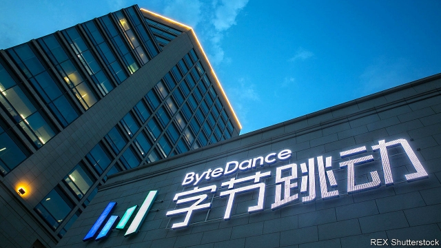

###### Dancing with the state

# Bytedance teams up with a state-run Chinese publisher 

 

> print-edition iconPrint edition | Business | Dec 21st 2019 

TIKTOK, A CHINESE-OWNED short-video app no Western teenager can do without these days, stresses its independence from the authorities in Beijing. Its parent company, less so. Bytedance, whose $75bn valuation makes it the world’s biggest unlisted startup, has just teamed up with Shanghai Dongfang Newspaper Company, a state-run publisher. The joint venture, in which Bytedance holds a 49% stake, will, among other things, develop technologies such as artificial intelligence (AI). 

It is not Bytedance’s first jive with the state. Since its founding in 2012 it has worked with most news organisations in China, many of them state-run, which it needs to feed Jinri Toutiao, its news app—all the more so since the launch two years ago of “New Era”, a channel that reports chiefly about government goings-on. In 2018 it hired a former anchor at CCTV, China’s state television, as vice-president. In April it signed a strategic partnership with Beijing Time, a news platform linked to the Beijing Municipal Party Committee. 

Toutiao is periodically chastised—by the government and users alike—for a dearth of serious content. The joint venture is looking to fill that gap. Shanghai Dongfang owns the Paper, a serious outlet which does proper investigative work (even if state censorship can dull its edge). 

Nor is Bytedance the only big Chinese tech firm that works closely with state-owned enterprises, especially in areas such as AI that the Communist Party regards as strategic. In 2016 Baidu, China’s biggest search engine, agreed to develop technology with a state-owned telecoms firm. In June Jack Ma, the founder of Alibaba, an e-commerce behemoth, met with SASAC, a government body which oversees state firms, to discuss tie-ups to promote digital innovation. Tencent, another internet giant, has been urged to do the same. 

Natural though it may appear in China, the joint venture comes weeks after America’s government opened a national-security review of TikTok on worries that it gives Beijing access to data on millions of Americans and censors content the regime does not like. Bytedance insists that data on non-Chinese users sit on non-Chinese servers and what Americans are or aren’t shown is decided in America. It adds that its new Chinese initiative will “focus on digital rights of short videos”. Such assurances are unlikely to impress its critics.■ 

