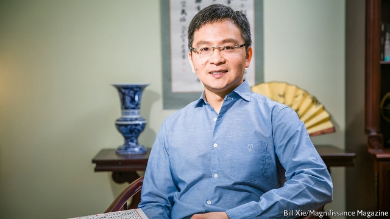

###### Party poopers

# Video blogs by critics of China’s Communist Party attract many fans 

 

> print-edition iconPrint edition | China | Dec 18th 2019 

BOOKISH AND soft-spoken, Wen Zhao never expected to become a celebrity. In Toronto, where he lives, Mr Wen is often asked for selfies by adoring fans (female ones are especially keen, he says bashfully). He owes his fame to a video blog, updated every two or three days, in which he talks in Mandarin about current affairs, often very critically of China’s ruling Communist Party. His viewers are mainly ethnic Chinese living outside China. But Mr Wen, who is 45, reckons many are in China itself, where he was born and grew up. 

In recent years party-controlled media have been trying to extend their influence abroad by buying up Chinese-language newspapers or reaching deals to provide them with news. But vloggers such as Mr Wen (pictured in his typical on-camera garb) are attracting huge audiences among overseas Chinese with commentary that does not follow the party line. They also appear to be penetrating the great firewall of China, as the country’s system of online censorship is often known. 

In one of his recent 20-minute monologues, published on YouTube, Mr Wen discussed a demonstration in late November in the southern Chinese town of Wenlou, over the building of a crematorium. Mr Wen noted that some participants had chanted “revolution of our times”. This is a popular rallying cry in neighbouring Hong Kong, which has been roiled for months by pro-democracy unrest. He speculated that similar sentiment may have begun to spread to parts of the mainland. 

Such views cannot be aired in China, where YouTube is blocked (as is Mr Wen’s personal website, wenzhao.ca). But tech-savvy netizens in China can access Mr Wen’s vlogs by using a virtual private network. Mr Wen’s videos have attracted about 175m views since the launch in 2017 of his YouTube channel, or about 300,000 views per recording. He says a fifth of the audience could be in China, a belief reinforced by messages he gets from mainlanders and analysis of traffic to his site. His vlog often has more than 100 times the viewership of news items posted on YouTube by China’s main state broadcaster. 

Mr Wen says politics in China has boosted the vlog’s popularity (except among trolls who bombard him with online abuse—possibly, he suspects, at the instigation of the Chinese government). Not long after the vlog was launched, China’s leader, Xi Jinping, abolished the presidential term-limit, fuelling speculation that he would never retire. China then entered into a protracted trade war with America. The shock of both events appears to have fuelled demand among Chinese speakers for independent analysis. Other vloggers have piled in, too. There are at least a dozen people whose YouTube channels in Mandarin relating to current affairs boast more than 100,000 subscribers. Most are based in North America. Among the best-known is Guo Wengui, a Chinese businessman (also known as Miles Kwok) who fled to New York in 2014. His vlog, with a following of more than 300,000, is filled with unverified titbits of political gossip. 

Party sympathisers use YouTube, too. One is Han Mei, a Canadian resident who sings the Chinese government’s praises in her vlogs. In a recent recording Ms Han argued that the Chinese army had “responded appropriately” to the Tiananmen Square protests of 1989 (it massacred hundreds, if not thousands, of people). Her channel has 92,000 subscribers. 

A Chinese couple in New York who go by the names Stone and Lexie run a joint YouTube channel. Stone describes it as the centre ground between Mr Wen and Ms Han. In the 20 months since its founding, the vlog has picked up 130,000 subscribers. At least some are likely to be in China. A young fan in Beijing says the couple are credible because the China they present “is neither as good as state media claim nor as bad as some foreign media suggest”. Stone, however, says he is sure he would be arrested were he to return to his native country. ■ 

