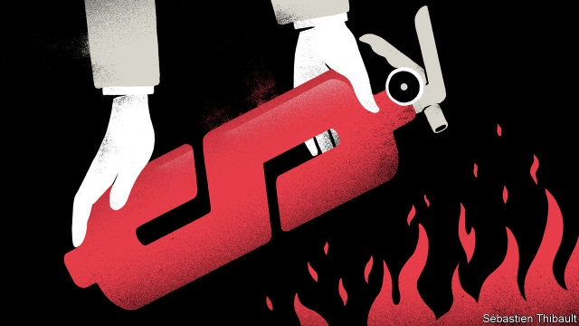
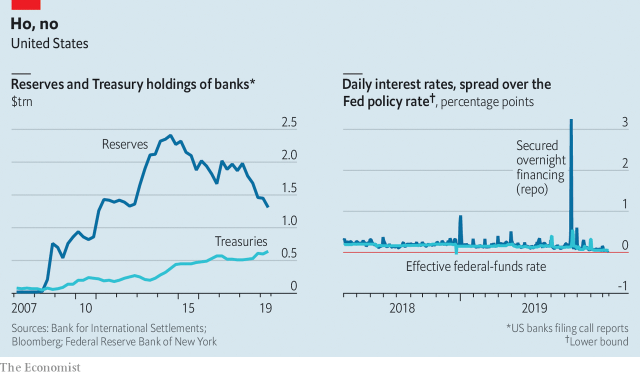

###### Free exchange

# Despite the Fed’s efforts, the repo market risks more turbulence 

 

> print-edition iconPrint edition | Finance and economics | Dec 18th 2019 

FROM ONE perspective, the Federal Reserve is expecting a quiet 2020. Of the 17 rate-setters at America’s central bank, 13 expect that it will not change interest rates at all during the coming year. But monetary-policy inaction does not mean that central bankers will enjoy a relaxing festive season. In another area for which they are responsible, there is trouble looming. The so-called repo market, through which financial firms lend each other more than $1trn every day, could cause the Fed a headache on December 31st—and a hangover in the new year. 

During 2019, as the Fed partially unwound the quantitative-easing (QE) programme under which it had bought Treasury bonds to stimulate the economy, the supply of cash reserves to the banking system dropped (see chart). Meanwhile, a large fiscal deficit—the result of America’s tax cuts and spending increases in recent years—prompted more Treasury issuance. Because buying Treasuries means handing over money to the government, demand for cash reserves rose. The repo market faced a supply squeeze and a demand surge at the same time. 

At first banks, of both the investment and the commercial variety, brought things into balance. According to a recent study by the Bank for International Settlements (BIS), a network of central banks, although they had hitherto been net borrowers from the repo market, as it tightened they became net lenders to it, easing the strain. But in September banks too found themselves short of cash when companies’ quarterly tax payments fell due and past Treasury purchases had to be settled. Both factors drained cash from the banking system and channelled it into the government’s coffers. The repo rate, that is, the interest rate charged overnight in the repo market, jumped above 10%. 

 

Since then the Fed has been firefighting. At first it offered to lend $75bn-worth of cash in repo markets overnight, every night—an offer that was lapped up. Then it began lending for periods of up to one month and increasing its limits on overnight operations to at least $120bn. Then it sought to replace these temporary fixes with an enduring solution. It began to increase its balance-sheet again, thereby permanently raising the volume of cash reserves in the banking system. It has done this by buying $60bn-worth of short-dated Treasuries per month. (It argues this operation is not another round of QE, which mostly involved buying long-dated Treasuries.) 

This week the new regime passed its first test. December 16th saw a repeat of the factors that had driven the repo rate higher in September. Payments for Treasuries and quarterly taxes were once again due, but the day passed without drama. The repo rate rose just 0.08 percentage points above recent levels, suggesting that the Fed’s efforts to make the market more resilient had succeeded. 

But at the end of 2019 a bigger hurdle looms. Regulators will determine the penalty the biggest banks—those deemed “global systemically important” institutions—must pay in the form of higher capital requirements. The penalty varies in increments, starting at 1% of risk-adjusted assets and rising depending on five gauges of riskiness. Among these are banks’ size and their reliance on short-term funding, which are judged throughout the year or final quarter. But the other three gauges—complexity, interconnectedness, and global activity—are measured just once annually, on New Year’s Eve. 

That once-a-year measurement encourages big banks that are close to a regulatory boundary to take temporary measures in order to shrink activities, such as lending in repo markets, that can push up their riskiness scores. These financial gymnastics matter because big banks have an outsize effect on repo markets. According to the BIS, the lenders most likely to scale up or down their repo-market activity in response to changing demand are the four biggest banks. Their apparent reluctance to lend in September was a central reason for the spike in interest rates. 

In 2018 end-of-year regulatory pressure caused the repo rate to reach 6% on December 31st. Fearing a similar episode, which could compound the more recent market stress, the Fed will offer to lend almost $500bn in repo markets over New Year’s Eve. But it might not work if banks, with an eye on their risk scores, are unwilling to perform their usual role as middlemen between the Fed and market participants who want cash. 

The spectre of further turmoil in the repo market is uncomfortable for the central bank. It has been trying to calm nerves. In a press conference on December 11th Jerome Powell, its chairman, acknowledged the probable upward pressure on repo rates to come, but was relatively sanguine. The Fed’s goal, he said, was “not to eliminate all volatility”. 

Yet regulators should not introduce volatility, either. It would be relatively easy to fix the problem in future years. Measuring banks on all five regulatory factors throughout the year would remove the pressure on them to try to look their best on New Year’s Eve. And varying the capital surcharge smoothly, rather than in steps, would eliminate regulatory arbitrage at the boundaries. 

The big picture is that there is a common culprit behind the sudden dysfunction in September and the prospect of further turmoil at the end of the year. Since the financial crisis, regulators have created a world in which compliance is a major influence on banks’ balance-sheets. That can interfere with the normal functioning of money markets and bring unintended consequences. 

The problem becomes most obvious at pinch points, such as December 31st, but is true more generally. And it is making the business of operating the financial plumbing—which was always low-margin and balance-sheet intensive—less appealing. “Big banks used to operate as the lender of second-to-last resort,” says Bill Nelson of the Bank Policy Institute, an industry lobby group. “That buffer is now gone.” Without it the Fed may need to get used to intervening more often. ■ 

