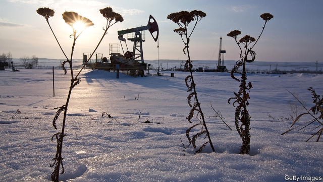
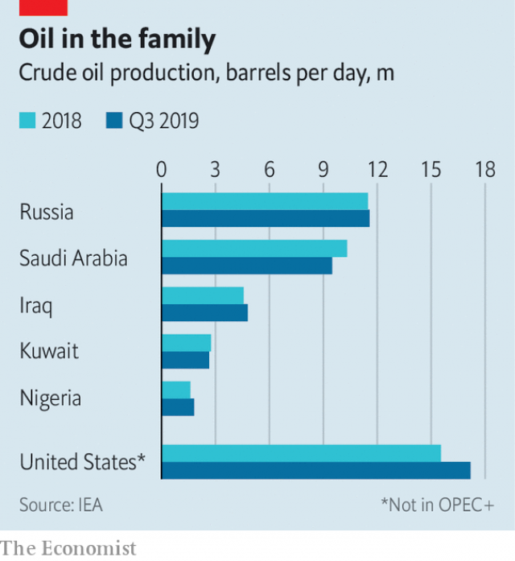

###### Push-me-pull-you

# The coming months will test OPEC’s sprawling alliance 

 

> print-edition iconPrint edition | Finance and economics | Dec 18th 2019 

IT HAS BEEN a difficult time for anyone betting on oil. Climate change threatens long-term demand. In the past year ample production, trade disputes and fears of an economic downturn have weighed on the price of crude. On December 3rd Brent crude fell to $61 per barrel—18% below its April high. Yet by mid-December forces were aligning to support oil prices again. The Organisation of the Petroleum Exporting Countries (OPEC) and its allies agreed on December 6th to lower output by more than 2.1m barrels a day. 

Adding to the optimism, Saudi Aramco, the world’s biggest oil company, listed 1.5% of its shares. On December 12th its market value surpassed an astonishing $2trn. And on December 13th President Donald Trump announced a preliminary trade agreement with China (see article). That bumped oil prices higher. As The Economist went to press on December 18th, Brent crude had risen to $65.74. 

Even so, oil gamblers are wrestling with two big uncertainties. The first concerns America’s output. The country pumped 17.8m barrels a day in November, compared with an average of 15.5m in 2018 (see chart). But investors have grown impatient with frackers’ meagre profits. The cost of capital for American exploration and production companies has jumped by about 50% since mid-2016, according to Goldman Sachs. At the start of December 663 rigs were operating in America, about a quarter fewer than a year earlier. America’s oil output will not shrink in 2020, but its growth may slow. The question is when, and by how much. 

The second uncertainty concerns whether the members of OPEC’s 23-country expanded alliance will stick to their new deal. The past 12 months give reason for scepticism. In December 2018 OPEC and its partners agreed to reduce output by 1.2m barrels a day. Iraq, Nigeria and Russia, among others, have regularly exceeded their allowed limits. To compensate, Saudi Arabia, OPEC’s most powerful member, slashed its own production by an average of 500,000 additional barrels a day, according to the International Energy Agency. 

 

Analysts at Morgan Stanley estimate that in 2020 1.8m additional barrels a day will be pumped in countries outside the OPEC alliance, including Brazil, Guyana and Norway. In the run-up to OPEC’s meeting in Vienna in December, it was doubtful whether the group would sustain the cuts agreed to a year earlier, let alone go further. 

In the end Saudi Arabia’s new oil minister, Abdulaziz bin Salman, wrangled an impressive deal. The alliance’s 1.2m-barrel cut will extend to 1.7m in January. Additional reductions led by Saudi Arabia will push the total to 2.1m barrels a day. The broader group’s collective output will be 1.3% below its level in November. It remains to be seen, however, if the cuts will materialise—or last. The new agreement covers only the first quarter of 2020. It also allows Russia to increase its output of condensate, a type of light crude. 

Saudi Arabia remains keen to support prices, both for its budget and to make Aramco’s listing a success. The firm’s soaring valuation in early trading may not be sustainable. Many big global investors were repelled by its low dividend yield, security risks and state control. But local retail investors piled in, attracted partly by the sweetener of an extra free share for every ten they buy and hold for six months. If Saudi Arabia’s allies fail to stick to their promised cuts, the kingdom will have a choice: slash its own production further or let prices fall. Neither is appealing. ■ 

