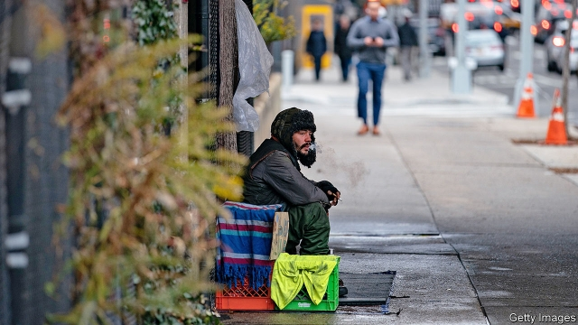

###### Mean streets

# How to cut homelessness in the world’s priciest cities 

 

> print-edition iconPrint edition | Leaders | Dec 18th 2019 

“I HAVE SLEPT on the Embankment,” wrote George Orwell in 1933, adding that, despite the noise and the wet and the cold, it was “much better than not sleeping at all”. Under the nearby Charing Cross bridge, Orwell reported that “50 men were waiting, mirrored in the shivering puddles.” Nine decades on and Charing Cross and the Embankment are once again full of rough sleepers, even during the coldest days of December. Across London their numbers have more than tripled since 2010. 

It is a pattern found in much of the rich world. Almost every European country is seeing a rise in the number of homeless people, including those who live in temporary accommodation, as well as the smaller number who live on the streets. Homelessness across America is in decline, but it is soaring in its most prosperous cities. Roughly 5,000 people live on the streets of San Francisco, a 19% rise in just two years. 

It does not have to be this way. In post-war America there was little rough sleeping, and homelessness was falling so fast that sociologists predicted its imminent disappearance. Even today, some rich, successful cities, including Tokyo and Munich, have few people living on the streets. 

These places offer lessons on how to reduce homelessness. One is that tough love can sometimes work. Conservatives argue that softer policing tactics in the 1970s, including lax attitudes to public drunkenness, were in part responsible for the rise in homelessness. The world could learn something from Greece, where strong family networks ensure that those down on their luck find someone to take them in. Many experts argue that it is counterproductive to give money to someone begging on the street. Better, they say, to donate to a charity. 

Yet tougher tactics will ultimately do little if housing costs remain high. This is the underlying reason for rising homelessness—which is perhaps one reason why America’s Supreme Court on December 16th affirmed that lawmakers may not criminalise rough sleeping. Few Americans lived on the streets in the early post-war period because housing was cheaper. Back then only one in four tenants spent more than 30% of their income on rent, compared with one in two today. The best evidence suggests that a 10% rise in housing costs in a pricey city prompts an 8% jump in homelessness. 

The state can do something to help. Cuts to rent subsidies for Britain’s poor are probably the biggest reason why Charing Cross has so many people sleeping on the streets once again (see article). Making such subsidies more generous might actually save governments money in the medium term—after all, demands on health-care services and the police would decline. People would also be more likely to find a job. 

Another option is for the state to build more housing itself. In Singapore, another place where there is practically no homelessness, 80% of residents live in government-built flats which they buy at knock-down prices. While many countries have been privatising their stock of public housing, Finland has been building more of it, giving the government the wherewithal to put homeless people in their own apartments rather than warehousing them in shelters (see article). It has embraced an approach originally pioneered in America, which does not demand that homeless folk quit drinking or drugs before giving them accommodation. Instead it gives them a home first, and then offers intensive support to help them cope with their problems. In Finland the homeless numbers are moving in the right direction. 

The most effective reform, however, would be to make building more homes easier. In many countries NIMBYist planning rules vastly inflate the market price of shelter. Such rules should be slashed. The problem of rough sleeping in Germany and Switzerland, two countries with minimal real-house-price growth in recent decades, is less acute. Japan has used its fair share of strong-arm tactics to deal with the homeless, but then it introduced a big urban reform in the early 2000s. 

Japan loosened planning rules, prompting residential construction to jump. Since then, housing costs in Tokyo have fallen in real terms and the number of rough sleepers has fallen by 80% in 20 years. Until cities elsewhere let the buildings go up, more people will find themselves down and out. ■ 

