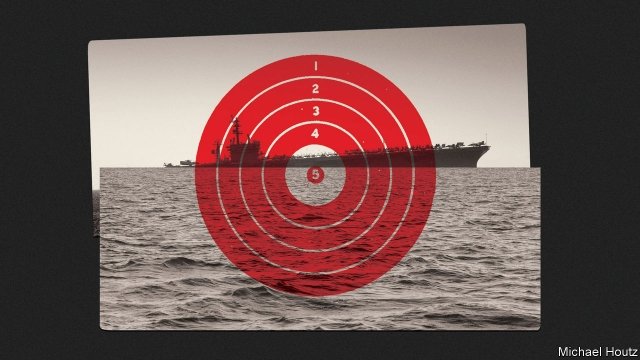

###### On purposeful firms, aircraft-carriers, dogs, ice-skating, Singapore, Oxford, “Macbeth”

# Letters to the editor 

 

> Dec 21st 2019 

Your article on encouraging purposeful business failed to convey or address what the British Academy report on the “Future of the Corporation” is saying (“On purpose”, November 30th). Our report suggests that a firm should establish a purpose, act according to it and have regard to its consequences for the interests of its shareholders and stakeholders. It says that a company should not profit from inflicting harm on others and should seek to provide profitable solutions to problems. What part of this does The Economist object to? 

I was disappointed that you did not cover our extensive discussion of the need for judicious leadership; nor the case for shareholders playing the role of stewards rather than owners; nor the complexity of the challenge faced by companies grappling with global issues that both private and state actors have failed to resolve. 

The Economist has missed the point. This is a subject that merits serious informed comment and debate. 

PROFESSOR COLIN MAYERAcademic lead on the British Academy’s Future of the Corporation programmeLondon 

 

The vulnerability of American aircraft-carriers (“Sink or swim”, November 16th) is the reason why the rescue of hostages in Iran failed 40 years ago. The navy absolutely refused to send a carrier to the Gulf for fear of Iranian missiles. They knew that the first carrier sunk would be the last ever built. So we had to launch from the Arabian Sea. Only cumbersome anti-submarine warfare helicopters had adequate range. Flown by attack chopper pilots in the marines who were unfamiliar with them, one got lost in a sandstorm, another marine threw his flak jacket on a vent and burned the motor, and after another helicopter failed for mechanical reasons a fourth stumbled into a refuelling aircraft and exploded, which is when the mission had to be scratched. However, during the first Gulf war, when the air force flew from the United Arab Emirates, the navy drove those carriers right up in there. 

The problem is that almost the entire surface navy is built around the Carrier Task Force. Without carriers the navy has no strategy and doesn’t know what else to do. 

AMBASSADOR DAVID AARONFormer deputy national security adviser to Jimmy CarterWashington, DC 

 

Regarding Lexington’s column on America’s obsession with dogs (“Impoochment”, November 23rd), Plutarch tells us that when Caesar saw wealthy Romans fawning over their pets he wondered whether they had children, and reflected on people “who spend and lavish upon brute beasts that affection and kindness” which is reserved for mankind. But Plutarch’s response to this was: 

“With like reason may we blame those who misuse that love of inquiry and observation which nature has implanted in our souls, by expending it on objects unworthy of the attention either of their eyes or their ears, while they disregard such as are excellent in themselves.” 

If only our dog-loving might remind us not just of our declining concern for humanity, but also how technology and scientific realism has occasioned the unfortunate disregard of moral philosophy. 

ROBERT SHAPIROChicago 

 

West Africa’s first ice-skating rink was indeed located in the Ivory Coast, albeit not in Yamoussoukro but in the Hôtel Ivoire in Abidjan (“Crocodile fears”, November 23rd). Built in 1963, the Hôtel Ivoire was the plush place in western Africa to go for ice skating, enjoy first class food or watch a film. The Economist once called it possibly the most beautiful hotel in the world (“Steady does it”, July 17th 1965). 

PETER STEINStockholm 

 

Contrary to your report (“False alarm”, December 7th), our Protection from Online Falsehoods and Manipulation Act should be looked at in the same context as our belief in the right of reply, which in our view enhances rather than reduces the quality of public discourse, and strengthens and safeguards proper public accountability that must necessarily underpin democracies. Online posts that have been corrected remain available in full, but with links to the government’s response appended. Readers can see both and decide for themselves which is the truth. How does twinning factual replies to falsehoods limit free speech? 

You also misrepresented the falsehoods that the government corrected. One post not only accused the government of rigging elections and conspiring to convert Singapore into a Christian theocracy, but also made false claims that it had arrested specific critics. Another did not only question the “investment nous of Singapore’s sovereign-wealth funds”, but based this on false allegations of losses that never occurred. The Economist itself recognises how serious a problem online falsehoods are, for example in “Anglichanka strikes again” (April 21st 2018). Fake stories have influenced British politics, notably in the Brexit campaign. Legislatures around the world have been grappling with this problem. 

Singapore, a small English-speaking, multiracial, multi-religious city-state open to the world, is more vulnerable than most to this threat. Having observed in Britain and elsewhere the cost of doing nothing, we decided to act. Singapore’s laws are designed to meet our own context and needs. We have no ambition to set any example for other countries, but neither do we make any apologies for defending our own interests. 

FOO CHI HSIAHigh commissioner for SingaporeLondon 

 

Your obituary of Jonathan Miller was excellent except in one detail: you said that he teamed up with three Cambridge friends to produce “Beyond the Fringe” (December 7th). Miller and Peter Cook went to Cambridge, but Alan Bennett and Dudley Moore were Oxford men. In fact, when I was steward in 1960 of the junior common room at New College, Dudley Moore’s jazz group occasionally used a room to store their instruments. I once engaged Dudley to play for one of our dances, for £5 and open bar privileges. 

RICHARD MIDDLETONSalt Lake City 

 

Nightmare before Christmas 

The caricature of Jo Swinson on your cover of December 7th reminded me of the witches I saw portrayed once in a production of “Macbeth”. Now that Ms Swinson has lost her seat in the British election, one could imagine her thinking in your illustration, “Is this a dagger which I see before me?” But with the Tories getting a huge majority, my concern is “Something wicked this way comes.” 

RICHARD ROBINSONLondon 

