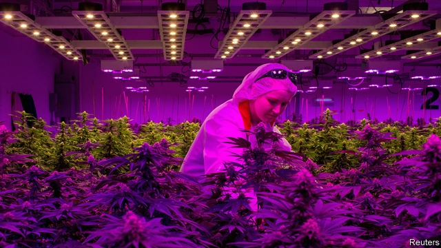

###### Down from a high

# Canada’s legal cannabis market gets off to a slow start 

 

> print-edition iconPrint edition | The Americas | Dec 18th 2019 

COLOURFUL CANS labelled Pink Kush, Moon and Trail Blazer are arranged invitingly in the glass-doored cooler at Superette, a cannabis store in the trendy Westboro area of Ottawa. But they are just models for marketing purposes. A sales clerk, wearing a white Superette toque and matching T-shirt, explains that cannabis-infused drinks and edibles, like chocolates, biscuits and sweets, will probably not go on sale until early January, even though the government finished its review process by December 16th. “Wheels of bureaucracy,” the salesman explains. 

In October 2018 Canada became the second country in the world, after Uruguay, to legalise cannabis for recreational use. But it has proceeded with caution. Sales of the plant, oils and seeds were legalised right away. Drinks, edible confections and vaping products followed a year later. This, plus slow approvals of retail outlets by some provinces, turned an expected bonanza into a bit of a bust. The industry is hoping that what it calls “Cannabis 2.0” will revive its fortunes. It may not. 

The government said that legalisation would help keep cannabis out of the hands of children and put criminals out of business. Progress has been slower than it wanted. Just 28% of consumers bought only from legal sources in the third quarter of 2019. The rest presumably are still buying on the black market, where prices are lower. Many of those smokers are no doubt under age. In the first year after legalisation legitimate sales were a disappointing C$907m ($690m). 

That is partly because finding one of Canada’s 407 legal pot shops is not easy. As of July this year Ontario had 24 stores for its 14m residents—two fewer than Newfoundland & Labrador, with a population of 530,000. In nine of the ten provinces distribution from growers to retailers is a provincial monopoly. The distributor’s extra paperwork is what slowed Superette down. 

Such problems have sobered Canadian firms, which had heady dreams of leading a growing global industry. The share price of Canopy Growth, the largest Canadian cannabis firm by market value, dropped from C$57 on the eve of legalisation to C$27 this week. That of Cronos Group, the second-biggest, has fallen from C$12 to C$7. 

These companies are counting on drinks and edibles to improve their fortunes. So are some big international booze firms such as Constellation Brands, which has invested in Canopy Growth, and Molson Coors, which has a joint venture with Hexo, a smaller cannabis firm. In American states where cannabis is legal, edibles accounted for 11% of the market in 2018, according to Deloitte, a consultancy. It estimates that edibles and drinkables could add C$2.1bn to sales in Canada. 

They could also draw in multinational consumer-goods companies that have so far stayed out of the market. Cannabis-infused beverages and biscuits are not so different from products they know how to make and sell. The big brands might push Pink Kush out of the cooler. ■ 

