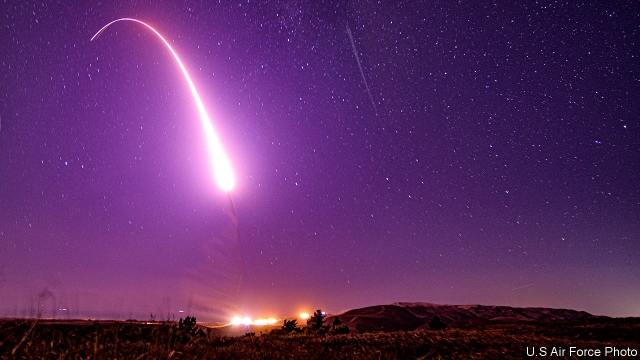

###### Going ballistic

# Missile-testing 

 

> print-edition iconPrint edition | United States | Dec 18th 2019 

IN THE EARLY morning of December 12th a missile streaked into the sky above Vandenberg air force base north of Los Angeles. It looped up into the blackness of space and then hurtled down into the Pacific—crucially, over 500km away. That makes it America’s first test of a ballistic missile that would have been forbidden under the 1987 Intermediate-range Nuclear Forces (INF) treaty, which banned both conventional and nuclear land-based missiles (but not air or sea-launched ones) with ranges of 500km to 5,500km. 

The pact died in August after Donald Trump walked out, having accused Russia of illegally testing and deploying several battalions of an intermediate-range cruise missile known as the SSC-8. Proponents of the move argue that land-based missiles are useful because mobile ground launchers are cheaper and can be replenished with fresh missiles more easily than ships, subs and planes, which can then be freed to do other things. 

The test is a signal that America is serious about pursuing this idea. It follows an earlier test on August 18th of another hitherto-banned ground-launched cruise missile fired from San Nicolas Island in California (cruise missiles use jet engines and fly low, whereas ballistic missiles are rocket-powered and arc through the sky). Both tests recycled existing systems: a 1980s-vintage Tomahawk in the summer, and what resembled a target-practice missile for the latest test. 

Turning old hardware into INF-range missiles is a quick and dirty way to turn out new weapons. Building 400 Tomahawks—which are currently fired only from ships and subs—and 50 ground launchers would cost $1.4bn, small-change for the Pentagon, according to a study by the Centre for Strategic and Budgetary Assessments (CSBA), a think-tank. But state-of-the-art weapons are also being considered. 

The army tested its new Precision Strike Missile (PrSM) for the first time on December 10th in New Mexico. The missile, which can be fired from existing launchers, had previously had its range capped at 499km; unencumbered by the INF treaty, it may now go as far as 800km. An even longer-range hypersonic missile is also in the works. The CSBA says that 400 brand-new ballistic missiles with 100 launchers would require $9bn or so. The Pentagon says that, unlike Russia’s SSC-8, its new missiles would not have nuclear tips. 

The political ground is now shifting in the Pentagon’s favour. On December 9th the two houses of Congress reconciled their duelling versions of the National Defence Authorisation Act (NDAA) after months of wrangling between missile-shy Democrats, who deplore Mr Trump’s withdrawal from the treaty and argue that new missiles are unnecessary fripperies, and Republicans, who want America to respond to China’s unconstrained build-up of about 2,000 missiles. In a sop to Democrats, the NDAA bans the Pentagon from buying or fielding new INF-range missiles before October 2020. But it is not much of a constraint: research and testing can continue, and new systems would take years to come to fruition anyway. A defence appropriations bill published on December 16th allocates $56m for missile research. 

The bigger hurdle is diplomatic. The NDAA obliges the Pentagon to submit a report on where new missiles would be deployed and how consultations with allies are going. Those are harder questions to answer. Mark Esper, the secretary of defence, said in August that he wanted to put new missiles in Asia “sooner rather than later”. But several of America’s best friends in the region immediately demurred. 

South Korea’s defence ministry said it had “not internally reviewed the issue” and had “no plan to do so”. Scott Morrison, Australia’s prime minister, said he could “rule a line under” the idea of such deployments: “It’s not been asked of us, not being considered, not been put to us.” On October 31st Japan’s defence minister insisted that “we have not been discussing any of it”. 

Europeans are also cagey. NATO squarely sided with America in blaming Russia for the collapse of the INF treaty, and some countries, like Poland, would welcome new missiles. But the alliance has generally preferred to emphasise defensive measures, rather than retaliatory deployments like those which provoked big protests in the “Euromissiles” crisis of the 1980s. 

In August Jens Stoltenberg, NATO’s secretary-general, argued that a Russian proposal for a moratorium on new missile deployments was “not a credible offer”—what was the point when Russia had already deployed missiles? But in November Emmanuel Macron, France’s president, broke ranks to say that Russia’s offer could serve as “a basis for discussion”. Even if a moratorium could be agreed on, it would probably cover only deployments in Europe, not those in Asia. 

Eric Sayers, a former special assistant to America’s Indo-Pacific Command, suggests that, as China’s power—and missile arsenal—grows, the diplomatic situation in Asia is likely to move in America’s favour. Japanese officials “understand the military case and know this will be a future ask”, he says. Any deployments there will probably be badged as rotational, rather than permanent, and might focus on anti-ship missiles rather than on those which target Chinese soil. Some American officials view this as leverage to force China into arms-control negotiations. Others just want to shore up a military balance that has been tilting in China’s favour. Either way, many more tests will have to come first.■ 

