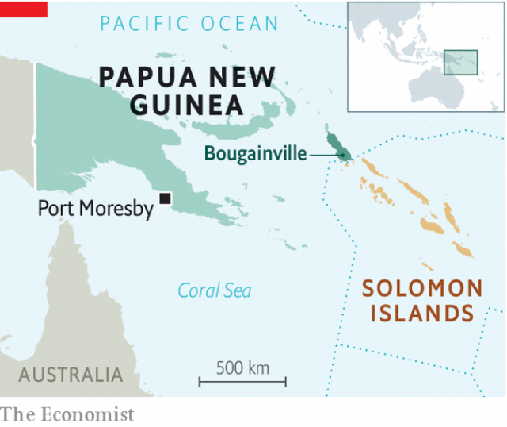

###### The 20-year itch

# Bougainville has voted for independence, but may not get it 

 

> print-edition iconPrint edition | Asia | Dec 18th 2019 

THE INTENDED destination is not in doubt. Fully 97.7% of voters on the Pacific island of Bougainville opted for independence from Papua New Guinea (PNG) in a referendum held in late November and early December. But how—and how fast—the island will get there remains far from clear. The outcome of the poll is not binding on the government, which inherited Bougainville, part of the archipelago that includes the Solomon Islands, as a quirk of colonial map-making. There will now be a lengthy consultation between the island’s autonomous administration and the national authorities. The ultimate say rests with PNG’s parliament. 

There are many reasons for delay. Bertie Ahern, a former Irish prime minister who oversaw the referendum, says the island’s 300,000-odd people are not ready for independence. James Marape, PNG’s prime minister, argues that Bougainville’s economy is too weak and has promised greater spending on infrastructure. The region’s main powers, Australia and New Zealand, fear the creation of a mendicant state on their doorsteps, susceptible, in particular, to Chinese bribes and blandishments. Nearly all of Bougainville’s revenue comes either from the central government or foreign aid. 

That was not always the case. Bougainville once boasted the third-largest copper mine in the world. It delivered close to half of PNG’s export revenues in the 1970s. But arguments about the distribution of revenue and jobs from the Panguna mine sparked an insurgency in the late 1980s, which forced the mine to close. PNG’s armed forces struggled to establish control over the island’s mountainous terrain and hostile population. They withdrew in 1990, and blockaded the island by sea instead. When PNG hired mercenaries from a firm called Sandline International to restore order, its own soldiers mutinied, prompting the government of the day to fall and Australia and New Zealand to step in to broker a peace deal. 

 

The agreement, signed in 2001, promised a referendum on independence by 2020 and self-government in the meantime. But the mine did not re-open, leaving the autonomous administration starved of cash. Other big mines and oil- and gasfields were developed on the mainland, diminishing the central government’s incentive to make autonomy work. National leaders’ main concern these days is that Bougainville might inspire other secessionist rebellions, given PNG’s diversity (its 8.5m citizens speak 839 languages), poverty, isolating terrain and dire infrastructure. 

The leader of the autonomous government on Bougainville, John Momis, once supported greater autonomy within PNG—the other option on the ballot in the referendum. But the stinginess of PNG’s fiscal transfers and its broader neglect of Bougainville drove him and other voters towards independence instead. Few islanders have confidence in Mr Marape’s promise to fix these problems, having heard such pledges before. 

In fact, there is a risk of lack of leadership on both sides. Mr Momis is 81 and must step down by June because of term limits. He has no obvious successor. Bougainville’s people, having voted so emphatically for independence, presumably expect speedy change. The politicians seem unlikely to gratify their desires. The chances of further discord are high. ■ 

