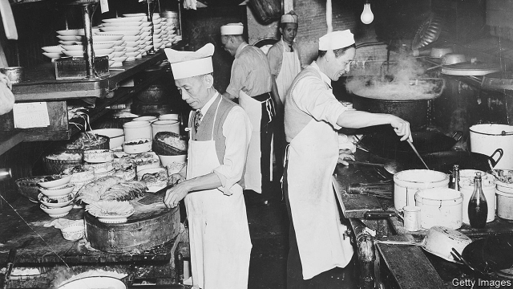
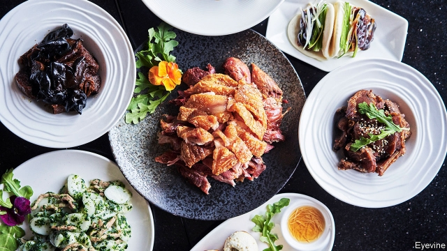

###### A bao in every steamer

# The apotheosis of Chinese cuisine in America 

 

> print-edition iconPrint edition | Books and arts | Dec 21st 2019 

FOR SEVERAL years, beginning in the mid-2000s, devotees of Chinese food on America’s east coast obsessed over a mystery: Where was Peter Chang? A prodigiously talented—and peripatetic—chef, Mr Chang bounced around eateries in the south-east. One day diners at a strip-mall restaurant in suburban Richmond or Atlanta might be eating standard egg rolls and orange chicken; the next, their table would be graced by exquisite pieces of aubergine the size of an index finger, greaselessly fried and dusted with cumin, dried chillies and Sichuan peppercorns. Or by a soup made of pickled mustard greens and fresh sea bass, in its way as hauntingly perfect and austere as a Bach cello suite. A few months later, Mr Chang would move on. 

He now seems to have settled down, running a string of restaurants bearing his name between Rockville, Maryland, and Virginia Beach. His latest—Q by Peter Chang—in the smart Washington suburb of Bethesda, may be his finest. The space is vast and quasi-industrial, with brushed concrete floors, massive pillars and not a winking dragon in sight. Order a scallion pancake, and what appears is not the typical greasy disc but an airy, volleyball-sized dough sphere. Jade shrimp with crispy rice comes under what looks like an upturned wooden bowl (perhaps, you think, for the shells). On inspection the bowl turns out to be the rice. Thumping through it with a spoon reveals perfectly cooked shrimp floating in shamrock-green sauce. 

A tab for two at Q can easily top three figures—several times the outlay on an average Chinese meal. Nor is Mr Chang’s the only such restaurant in the area: like many big American cities, Washington has seen a rise in high-end Chinese cuisine. That is good news, and not just for well-heeled gourmands who can tell shuijiao from shuizhu. The culinary trend is underpinned by two benign social ones. Chinese-Americans are becoming wealthier and more self-confident; and customers are shedding old stereotypes about Chinese food. To put it another way: sometimes a dumpling is more than just a dumpling. 

Chinese restaurants began to open in America in the mid-19th century, clustering on the west coast where the first immigrants landed. They mostly served an Americanised version of Cantonese cuisine—chop suey, egg fu yung and the like. In that century and much of the 20th, the immigrants largely came from China’s south-east, mainly Guangdong province. 

After the immigration reforms of 1965 removed ethnic quotas that limited non-European inflows, Chinese migrants from other regions started to arrive. Restaurants began calling their food “Hunan” and “Sichuan”, and though it rarely bore much resemblance to what was actually eaten in those regions, it was more diverse and boldly spiced than the sweet, fried stuff that defined the earliest Chinese menus. By the 1990s adventurous diners in cities with sizeable Chinese populations could choose from an array of regional cuisines. A particular favourite was Sichuan food, with its addictively numbing fire (the Sichuan peppercorn has a slightly anaesthetising, tongue-buzzing effect). 

Yet over the decades, as Chinese food became ubiquitous, it also—beyond the niche world of connoisseurs—came to be standardised. There are almost three times as many Chinese restaurants in America (41,000) as McDonald’s. Virtually every small town has one and, generally, the menus are consistent: pork dumplings (steamed or fried); the same two soups (hot and sour, wonton); stir-fries listed by main ingredient, with a pepper icon or star indicating a meagre trace of chilli-flakes. Dishes over $10 are grouped under “chef’s specials”. There are modest variations: in Boston, takeaways often come with bread and feature a dark, molasses-sweetened sauce; a Chinese-Latino creole cuisine developed in upper Manhattan. But mostly you can, as at McDonald’s, order the same thing in Minneapolis as in Fort Lauderdale. 

Until recently, the prices varied as little as the menus—and they were low. Eddie Huang, a Taiwanese-American restaurateur turned author and presenter, recounts how his newly arrived father kept his prices down because “immigrants can’t sell anything full-price in America.” 

That, in truth, was a consoling simplification. Americans have traditionally been willing to pay through the nose at French or Italian joints (where, in fact, Latinos often do most of the cooking). And every city has its pricey sushi bars and exorbitant tapas restaurants (tapas, as one joke goes, is Spanish for “$96 and still hungry”). 

But Mr Huang is right that Americans have long expected Chinese food to be cheap and filling. One step up from the urban takeaway, with its fluorescent lighting and chipped formica counter, is the strip-mall bistro with its imposing red doors and fake lions standing guard—sufficiently exotic to be special, but still affordable enough for a family to visit once a week when nobody feels like cooking. 

Even the superior outlets were cheap for what they served (and often still are). Consider the hand-ripped noodles with lamb at Xi‘an Famous Foods in lower Manhattan. A tangle of long noodles, each about the width of Elvis Costello’s ties in the late 1970s, is tossed with curls of braised lamb and a complex, incendiary sauce laced with cumin and chillies—all for just over $10, a fraction of the price of comparably accomplished dishes at smart restaurants nearby. True, Xi‘an Famous Foods has no waiters (diners carry their plates on plastic trays to bench seating). But its noodles are handmade, and the lamb dish may be the single best thing to eat in New York at any price. 

But now things are changing. Mr Huang sells deliciously pillowy stuffed buns in New York and Los Angeles for $5.50 each—or, as he puts it, “full fucking price”—and encourages other immigrants not to undervalue their work. Restaurants in Q’s bracket are cropping up not just in America’s Chinatowns but in the suburbs, where Chinese immigrants and their families have settled, following the classic strivers’ path. The median income of Chinese-Americans’ households is nearly 30% higher than the average. They are more than twice as likely as other Americans to have an advanced degree. 

 

Meanwhile, although racism persists, the pervasive discrimination of earlier ages has waned. Witness the presidential campaign of Andrew Yang, in which his ethnicity has scarcely been mentioned. Since the Chinese-American population is six times as big as 40 years ago, Americans overall are much more familiar with Chinese people and their cooking. All of which means that, in your correspondent’s fairly extensive experience, the new fancy breed of Chinese restaurants draws a heartening mix of Chinese and non-Chinese diners. 

Not everyone is enticed. The same cult of authenticity which decrees that good tacos only come from trucks posits that the best Chinese food is found in humble settings. That is as inaccurate as the snobbery that Mr Huang decries. Chinese chefs are as ambitious as any others; a bowl of noodle soup no more stands for all of Chinese cuisine than a slice of pizza does for Italian. 

In any case, authenticity is a slippery commodity. Recipes constantly evolve as people move and mingle. The chillies now considered essential to Sichuan dishes were actually brought to China by Iberian traders in the late 16th century. Hot dogs were originally German, pizza Neapolitan, bagels Polish—but now they are all American, and like America, infinitely varied. 

The goat ribs at Duck, Duck Goat, in Chicago’s trendy meatpacking district, are more Chinese-ish than Chinese. So is the place itself—headed by a non-Chinese chef and kitschily decorated with paper lanterns and bright red walls. The ribs come as a mesh of burnished meat stilettos with a wonderful chew, the sweetness of the glaze giving way to the goat’s irresistible gaminess. They spark fights over who gets the last one. They are as inauthentic, and as imaginative and lovingly created, as Mr Chang’s scallion dough sphere—and as delicious, which in the end, is what counts. ■ 

