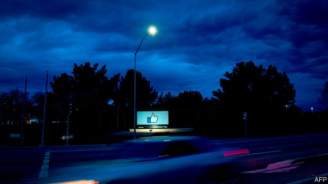

###### The data sheriffs

# Companies should take California’s new data-privacy law seriously 

 

> print-edition iconPrint edition | Business | Dec 18th 2019 

HISTORY DOES not repeat but sometimes it rhymes. So, it seems, do efforts to protect netizens’ privacy. The European Union led the world with its General Data Protection Regulation (GDPR), which came into force in May 2018. That law shook up internet giants and global advertising firms, both of which had previously used—and at times abused—consumer data with little oversight. On December 11th India’s government introduced a bill that would force firms to handle data only with consumer consent and give the authorities sweeping access to them. The same day Scott Morrison, Australia’s prime minister, promised a review of privacy laws and said the competition authority will monitor how advertising is done on digital platforms. But the most important piece of legislation rhyming with GDPR right now is the California Consumer Privacy Act (CCPA), which comes into force on January 1st. To online businesses, it jars. 

The Californian law copies some of the GDPR’s provisions. It gives consumers the right to know what online information is collected about them and how it is used, permits them to demand that their data be destroyed and to sue companies for data breaches. In some ways, the CCPA is looser than its European predecessor. It does not, for instance, insist that firms have a “legal basis” for collecting and using personal data or restrict the international transfer of data. It also stops short of demanding the appointment of corporate data-protection officers and assessments of projects’ data-protection risks. And whereas the GDPR lets individuals demand that private information about them be removed from the web under certain circumstances, the First Amendment makes this “right to be forgotten” a non-starter in America. 

In other respects, though, California goes further than the EU. The CCPA adopts a broader definition of personal information (which extends to such things as internet cookies that identify users on websites) and it explicitly forbids discrimination (by offering discounts to those who grant firms access to their data). Companies must enable Californians to opt out of the sale of personal data with a clear “do not sell” link on their home page, rather than through GDPR’s fiddlier process. Michelle Richardson of the Centre for Democracy and Technology, a privacy-advocacy group which is bankrolled in part by big tech companies, calls the CCPA “ground-breaking”. 

 

The California law will apply to firms with revenues of $25m or more that do business in the state or process its residents’ data, even if not based there. Any for-profit entity anywhere that buys, shares or sells the data from more than 50,000 Californian customers, households or devices a year is also covered. Law-breakers face fines of up to $7,500 for every violation, compared with 4% of global annual revenues or €20m ($22m), whichever is higher, for the GDPR. But California’s relatively trifling ceiling can add up quickly for firms with thousands of users. 

The GDPR’s track record suggests the effects of the CCPA will be far-reaching. Some 250,000 complaints have been lodged under the EU rules, and some penalties approach €100m. If breaking the rules could prove expensive, so is respecting them. The International Association of Privacy Professionals, an industry body, and EY, an accountancy, reckon that complying with the GDPR costs the average firm $2m. Tech firms spend over $3m; financial firms, more than $6m. By one estimate, the total cost to all American firms with more than 500 employees could reach $150bn. 

“Initial compliance” with the CCPA may, for its part, cost the estimated 500,000-odd affected American firms $55bn, according to a study commissioned by California’s attorney-general. Any such estimates should be taken with a grain of salt. For one thing, global firms that are already GDPR-compliant have a head start, even if differences between the two laws mean abiding by the Californian one will be far from automatic. Big firms, which are already on the hook for GDPR, are expected to spend another $2m each. For the tech giants that looks like chump change. Microsoft and Apple say they are not only ready for CCPA, but also plan to implement it across America. 

For America’s legions of smaller online trinket-sellers, app-makers or other firms present on the internet the Californian law will be onerous. They can ignore European regulations, because most have no EU business, but cannot easily stay away from one of America’s biggest domestic markets. A new survey by the US Chamber of Commerce, a lobby group, claims that only 12% of small businesses in America know about the law, let alone have prepared for it. 

The impact of the CCPA is being felt beyond boardrooms. Big Tech is lobbying lawmakers in Washington, DC, for a federal statute on the subject. “We really, really support an omnibus federal privacy law,” says a data-privacy official at a large American technology company. Facebook and Google do, too, they profess. The US Chamber of Commerce, better known for opposing regulations, is also now in favour. 

One explanation for tech firms’ sudden enthusiasm to safeguard user information is their reasonable desire to avert a balkanised mess of contradictory state laws. Illinois, New York and Washington have differing state legislation in the works. Many others are looking into the matter. 

Tech companies could have another motive to back federal rules. Because much online activity crosses state boundaries it falls under federal jurisdiction. A national data law would therefore supersede California’s, unless it explicitly made federal rules the floor which states could raise if they wished. A Democratic proposal in the Senate does just this. A rival Republican one would set business-friendlier rules as the ceiling, in effect obviating the CCPA. No points for guessing which one of these America Inc would prefer. Neither is likely to pass before November’s presidential elections. Until then companies will need to heed California’s data sheriffs. After that, expect a shoot-out. ■ 

