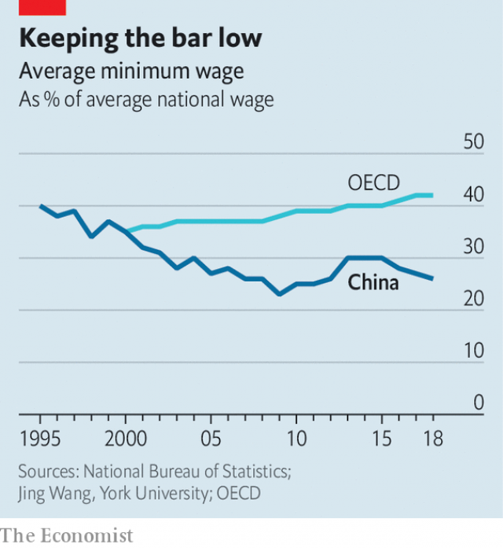

###### Keeping caps out of hands

# China once stressed the importance of setting minimum wages 

 

> print-edition iconPrint edition | China | Dec 18th 2019 

XIANG JINGUO works as a security guard in the industrial city of Shijiazhuang, 300km (185 miles) south-west of Beijing. He has long been living on just 1,700 yuan ($237) a month. He grumbles about the rising cost of food, especially the soaring price of pork. “I’ve become an unwilling vegetarian,” he huffs. Happily for him, however, the monthly minimum wage in his city was raised to 1,900 yuan on November 1st, up from 1,650 yuan. “Now I can try going back to my normal diet,” he says. 

Minimum wages have long been a feature of most advanced democracies. America introduced a national minimum wage in 1938. Japan did so in 1959. China caught up in 1995 when it revised its labour law to require local governments to set a wage floor. The central government stressed the “importance and urgency” of this as a way of “protecting workers’ rights”. 

In recent years, however, the mood has changed. Despite the rising cost of living, Mr Xiang had to endure a three-and-a-half year gap between adjustments of the minimum wage in Shijiazhuang. The law used to say that local governments must revise them every two years. In 2015 this was extended to three years, but the authorities in Shijiazhuang still dawdled. Provincial governments set different floors for each city within their jurisdiction based on such factors as the local cost of living and unemployment rates. In 2019 just eight provinces raised minimum wages, down from 15 the year before. In 2010 all but one of China’s 31 provinces raised them. 

To ensure that firms do not squeal, officials have tried to keep minimum wages low. Most employers observe them—a good indication that they are not too onerous. Yanan Li of Beijing Normal University estimates that only about 5-10% of Chinese workers earn less than the minimum, a smaller proportion than in most developing countries that have such a system. By taking an average of the highest minimum wages in each province, Jing Wang of York University in Canada has calculated a notional national minimum wage. She finds that the ratio of the minimum wage to the average wage has fallen sharply since 1995 (see chart), from 40% to just 26% in 2018. In the OECD, minimum wages were 42% of average wages in 2018, up from 35% in 2000. 

 

The central government appears to want localities to use changes in the minimum wage as a way of indicating how much they would like wages in general to rise. Since China’s economic growth began slowing early in the 2010s, provinces have parted company in their enthusiasm for raising the level. Inland spots such as Hebei, which are poorer than coastal areas, want to compete using their abundant cheap labour. The manpower-rich south-western region of Chongqing, where growth slowed from 11% in 2016 to 6% in 2018, waited until the last day of the three-year window before modestly increasing its minimum wages in January 2019. 

Richer areas with a shortage of labour have gone the other way. Shanghai, for instance, has raised its minimum wage every year since 2010. It now has China’s highest monthly wage floor, at 2,480 yuan. That is a sign it wants to move up the value chain and attract higher-wage workers. 

Initially the central government stood back when local officials failed to punish companies for ignoring the rules, perhaps reckoning that strict enforcement might deter at least some firms from hiring. But in the early 2000s it grew more worried that fast-rising income inequality would cause unrest. In 2004 it began demanding tougher enforcement. The fine for firms that misbehave was raised from a fifth of the accumulated shortfall in wages paid to five times the arrears. “Full implementation” of the minimum-wage rules was needed to reduce “excessive income inequality”, said the Ministry of Commerce. 

In 2011 the government unveiled a new five-year plan that set a target of increasing minimum wages nationwide by at least 13% annually. The goal was achieved, but some firms, especially in poorer provinces, complained (the rises were far higher than inflation each year). In the north-eastern province of Liaoning, a leader of the chamber of commerce says his organisation tried to convince the local government to “slow down a bit”. As growth slowed, companies in backward areas grumbled that big and frequent increases in the minimum wage were harming competitiveness. 

In the latest five-year plan, adopted in 2016, the central government appears to have accepted this argument. The document sets no minimum-wage targets. Central officials have refrained from berating provinces for foot-dragging. In July Economic Daily, a state-controlled newspaper, said that those setting minimum wages should not only take into account the interests of “low earners” but also “the actual burden on enterprises”. 

Officials still talk about a need to reduce income inequality. But they no longer suggest that increasing the minimum wage frequently is a good way of achieving this. Mr Xiang, the security guard, says he understands why his wages are not rising faster. “The reality is that there are still too many unskilled people like me,” he says. ■ 

