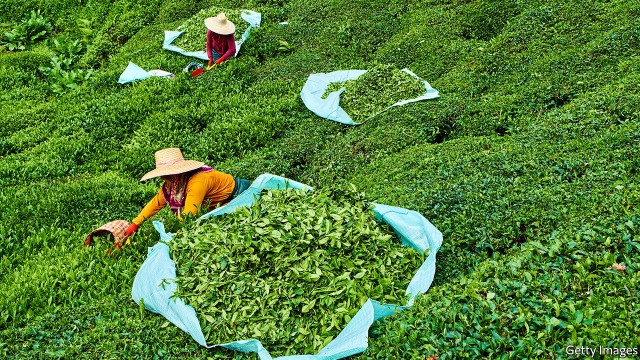

###### A nice cuppa taxpayers’ cash

# Why Turkey subsidises organic tea 

 

> print-edition iconPrint edition | Europe | Dec 18th 2019 

THERE IS SO little Turks agree on these days that even settling on the country’s national drink is hard. Secularists pick raki, a tipple best had with grilled fish and music. Religious conservatives, including President Recep Tayyip Erdogan, insist on a milky and non-alcoholic drink called ayran. 

A good thing, then, that there is tea, around which all can unite. An average Turk gets through about 3.5kg (7.7lb) of tea every year, or almost four glasses a day, ahead of every other country including Britain, India, China and Russia. Turkey is also the world’s sixth-biggest producer of the leaf. No one has ever entered a house or a government office in Turkey without being offered a glass. (Cups are for coffee, or for tourists.) 

Now change is brewing in an ancient industry. The government is offering subsidies to tea farmers who go organic, hoping that well-heeled foreigners will then pay more for Turkish tea. The state tea company, Caykur, the country’s largest producer, will convert entirely to organic farming by 2023, modern Turkey’s centenary. 

At one of the company’s factories near Rize, a drab city bordered on one side by the sea and by mountains draped in green carpets of tea on the other, the manager, Koksal Kasapoglu, says the policy has already yielded results. Organic production at Caykur has shot up from under 100 acres a decade ago to about 10,000 today, about 5% of the total area under cultivation, he says. 

Tea owes its popularity in Turkey largely to price. In the second half of the 19th century, when tea arrived in the Ottoman empire, the economy was in decline. Many Turks chose the new drink over coffee, which they had been sipping for centuries, but which had become hard to afford. 

Price is just as important today. Partly because organically grown tea requires more land to produce the same amount of crop, it costs roughly twice as much as the standard kind. Taxpayers’ cash can no doubt persuade many farmers to go organic. But with the economy sputtering, convincing Turkish tea-drinkers to buy the stuff will be harder. 

