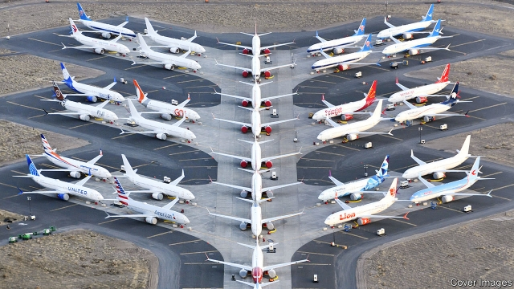

###### After the crashes

# Boeing’s misplaced strategy on the 737 MAX 

 

> print-edition iconPrint edition | Leaders | Dec 18th 2019 

Editor's Note (December 23rd): After publication of this article, Boeing sacked its chief executive, Dennis Muilenberg, on December 23rd. He will be replaced by David Calhoun, the company's chairman, who will take up the post in January. 

IN MARCH A Boeing 737 MAX aircraft crashed in Ethiopia, just six months after a similar accident in Indonesia. Nearly 350 people were killed in the two disasters, which revealed a flaw in the MAX’s flight-control system and put into question a vast industrial enterprise. Airlines are relying on the delivery of thousands of MAX planes over the next decade or so. Boeing was expected to make up a large share of its future profits from the MAX. The firm is one of America’s biggest exporters and at least a million people work for it or for its suppliers. 

Since March Boeing’s response has been an ugly mixture of remorse, evasion and swagger, as it has gambled that it can get the MAX, and its business, rapidly back in the air. On December 16th that strategy ran out of runway when the firm announced it would suspend production of the stricken plane. 

Boeing’s defiance began with its decision to stick with its chief executive, Dennis Muilenburg (although he was replaced as chairman in October). There has been no public, comprehensive, independent investigation by the firm into what went wrong. In its place there have been leaks galore and reports about software problems and corners being cut. 

Even though the MAX is not allowed to fly, Boeing’s factories have continued to churn out new planes that sit on the tarmac while customers are unwilling or unable to take delivery of them or make full payment. The firm signalled to Wall Street that business would return to normal soon enough and it continues to pay a dividend, despite burning up $3bn of cash last quarter. Boeing had indicated to investors, suppliers and customers that the MAX would be flying by the end of 2019, even though this is a decision it should not be able to determine. 

Boeing no doubt wants to protect its workers and defend itself from a barrage of lawsuits. But the industry’s lack of competition lets it get away with poor behaviour. In the short run the other half of the passenger-jet duopoly, Airbus, cannot increase output so as to offer customers an alternative source of aircraft. There is a queasy sense that Boeing has played a game of chicken with regulators. In stoking expectations that the MAX will be airborne again soon and keeping production humming, it has presented regulators with an unenviable choice: either to let the MAX back in the air whether or not it is ready, or to damage the industry and the American economy. 

Boeing’s strategy has backfired. America’s Federal Aviation Administration (FAA), the tarnished regulator which at first declined to ground the MAX, has found its backbone under new management and said that it is not yet ready to rule that the flight-control problem has been fixed. In the past foreign regulators have followed the FAA’s lead, but a majority of Boeing’s sales are now made outside America and authorities abroad no longer want to play wingman to the FAA. Both China and the EU have indicated that they are not yet happy. The number of idle, new MAXes piling up has grown to 400. Boeing’s strategy has strained its balance-sheet, with its inventories reaching $73bn and gross debts $25bn. 

It is time for a different approach. Mr Muilenburg should be removed and the firm’s board of directors beefed up. If Boeing does not do this voluntarily, its owners and regulators should insist. Production of the MAX should resume only when the firm has received approval from regulators around the world. Boeing needs to shore up its balance-sheet, so that it has the resources to invest and to help tide over crucial suppliers—which means eliminating its dividend. And lastly it needs to come up with a medium-term plan for life after the MAX, in the form of a next-generation aircraft, perhaps one that relies on hybrid-electric propulsion. Over the past decade Boeing has skimped on research, development and capital spending, investing only 7% of its sales on average, compared with around 10% at Airbus. Once the 737 MAX was the future. It is time for a new pilot and a new course.■ 

