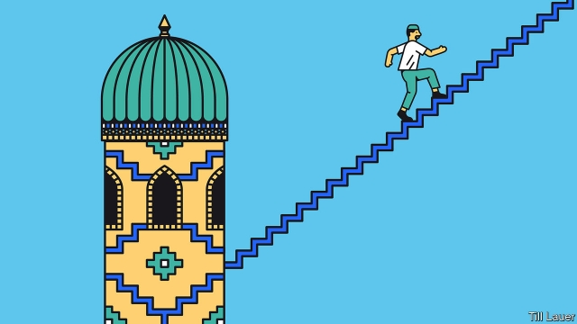

###### The Economist’s country of the year

# Which nation improved the most in 2019? 

 

> print-edition iconPrint edition | Leaders | Dec 21st 2019 

OUR ANNUAL “country of the year” award celebrates improvement. Each December, therefore, we give a hostage to fortune. The places that climb furthest are often those that started near the bottom: poor, ill-governed and unstable. Freshly won democracy and peace do not always last, as Aung San Suu Kyi, the leader of Myanmar (The Economist’s country of the year in 2015) ended up reminding the world when she appeared recently at the International Court of Justice in The Hague and glossed over the ethnic cleansing of the Rohingyas, a Muslim minority, by her country’s soldiers. 

In 2019 the most striking political trend was a negative one: belligerent nationalism. India has been stripping Muslims of citizenship, China has been locking up Muslims in camps, America has taken a wrecking ball to global institutions. So strong was the global tide that it was a relief to see some countries paddling the other way. New Zealand deserves an honourable mention for its response to a massacre in mosques by a white nationalist. Jacinda Ardern, the prime minister, put on a headscarf and declared that an attack on Muslims was an attack on all New Zealanders. Her government banned semi-automatic weapons and bought thousands of them from the public. 

Even more impressive was North Macedonia, which changed its name to promote peace with its neighbour. Greece had objected that its former moniker, Macedonia, implied a claim to the Greek region of the same name. Greek intransigence prevented the Macedonians from joining NATO or starting negotiations to join the European Union. So lawmakers in Skopje swallowed their pride and voted to rename their country; the change took effect in February. Relations with Greece are now much warmer. A source of discord has been removed from a tetchy region. North Macedonia is on track to join NATO. Alas, Emmanuel Macron, the president of France (country of the year 2017) is blocking its candidacy for the EU, fearing that welcoming another Balkan state into the club would irk French voters. 

Two countries became notably less despotic in 2019. In Sudan mass protests led to the ejection of Omar al-Bashir, one of the world’s vilest tyrants. His Islamist regime had murdered and enslaved so many black Africans that a third of the country broke away to form South Sudan in 2011. Mr Bashir was convicted of corruption in a Sudanese court on December 14th (see article) but seems unlikely to be extradited to stand trial for overseeing genocide in Darfur. A new power-sharing government vows to hold elections in three years, is negotiating peace in Darfur and has eased the dress code for women. However, the risk that thugs from the old regime may scupper democratic reforms is still worryingly high. 

So the winner is a country Herman Cain, an American presidential candidate, once dismissed as “Ubeki-beki-beki-stan-stan”. Three years ago Uzbekistan was an old-fashioned post-Soviet dictatorship, a closed society run with exceptional brutality and incompetence. Its regime allegedly boiled dissidents alive, and certainly forced legions of men, women and children to toil in the cotton fields at harvest time. 

When Islam Karimov, the despot for 27 years, died in 2016, he was succeeded by his prime minister, Shavkat Mirziyoyev. At first, little changed. But after dumping the head of the security services in 2018, Mr Mirziyoyev began reforms that have accelerated over the past year. His government has largely ended forced labour. Its most notorious prison camp has been closed. Foreign journalists are let in. Bureaucrats are banned from calling on small businesses, which they previously did constantly, to bully them for bribes. More border crossings have opened, helping unite families divided by Central Asia’s crazy quilt of frontiers. Foreign technocrats have been invited to help overhaul the state-stifled economy. 

Uzbekistan is to hold parliamentary elections before the new year (see article). Although it is far from a democracy—all of the parties support Mr Mirziyoyev and some critics remain behind bars—some of the candidates have offered mild criticisms of the government, which would previously have been unthinkable. Ordinary Uzbeks, too, feel free to lampoon the campaign and grumble about the political class, without fear of being dragged off in the middle of the night. Uzbekistan still has a long way to go, but no other country travelled as far in 2019.■ 

