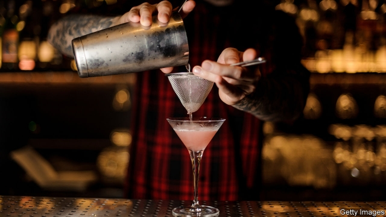

###### Adventurous spirit

# Elephant dung is fuelling South Africa’s gin boom 

 

> print-edition iconPrint edition | Middle East and Africa | Dec 18th 2019 

YOU MIGHT think that elephant dung is best kept far away from gin, which most people find tasty enough served with tonic water and a slice of lime. Not so, say Paula and Les Ansley, South African distillers who infuse theirs with pachyderm poo to capture “the textures and flavours of the African bush” and sell it for 659 rand ($46) a bottle. Indlovu gin may be aimed primarily at those with an “adventurous spirit”, but it is only the latest splash of ethanol on a market that has caught fire. In 2018 South Africans sipped 54% more gin than the year before, reckons IWSR, a research firm. 

Meeting this demand are dozens of new firms. At the inaugural SA Craft Gin Awards in August there were 110 entries. “For decades we have been drinking many imported British gins,” says Jean Buckham, who runs The Gin Box, a subscription service that deals exclusively in South African craft gin. “Until recently, we had never really South Africanised it.” In 2015 there were fewer than a dozen gin distilleries. Now there are 50, of which 30 are in the Western Cape. Part of the region’s attraction is its wealth of “botanicals”, or natural flavourings, which make each gin taste different. Inverroche, one of the pioneers of South Africa’s craft industry, uses fragrant fynbos shrubs. It makes 18,000 bottles a month and exports to 17 countries. 

Three factors explain South Africa’s boom. The first is that gin is becoming more popular everywhere. Consumption increased by 8% around the world and 52% in Britain in 2018. Another was a liberalisation of licensing laws after the end of apartheid in 1994 that made it easier to start a distillery and for non-whites to consume the same types of alcohol as whites. (Under the racist regime it was hard for black South Africans to go to liquor shops to buy “white” booze; instead they went to informal boozers called shebeens.) 

The last is that producers of South Africa’s more famous drink, wine, are struggling. A gin distillery can be set up in a warehouse; a vineyard needs sun, water and land. Across the Western Cape vintners are wrestling with recent droughts, contested land claims and weak prices. BDO, a consulting firm, reckons that only half of vineyards are making money. 

Even as posh new craft gins generate a buzz, most South Africans stick to the cheaper stuff. Gins that cost more than 225 rand a bottle account for just 6% of sales. But for those who can afford to splash out, the delights of elephant dung and tonic await. 

