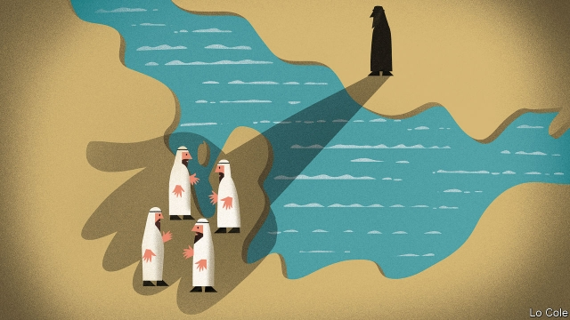

###### Making up is hard to do

# The Gulf states reconsider their feud with Qatar 

 

> print-edition iconPrint edition | Middle East and Africa | Dec 18th 2019 

WALKING ONTO a football pitch hardly seems an act of high diplomacy. But two and a half years into the embargo of Qatar by three Gulf neighbours—Bahrain, Saudi Arabia and the United Arab Emirates (UAE)—it may count as progress. The three had planned to boycott the annual Gulf Cup because it was being held in Doha, the capital of Qatar. In November, though, they changed their minds, and on December 2nd the Emiratis took the field against the Qataris. The Emiratis lost 4-2. Adding insult to injury, the defeat came on their national day, which marks the unification of several emirates into the UAE. Still, the match ended amicably enough, a far cry from an Asian Cup tilt in January, when the victorious Qatari squad was pelted with shoes and bottles by the crowd in Abu Dhabi, the capital of the UAE. 

The embargo, imposed in June 2017, has divided families, diverted planes and caused a deep rift in the six-member Gulf Co-operation Council (GCC). Qatar refuses to comply with a list of demands from the Saudi-led camp, such as cutting ties with Islamist groups and closing Al Jazeera, a satellite news channel. But there are growing signs that some of the blockading states want to end the feud anyway. Apart from the football diplomacy, Saudi Arabia and Qatar have held quiet talks about a resolution. On December 10th Qatar’s prime minister flew to Saudi Arabia for a GCC summit, the emirate’s highest-level representation in two years. No one expected it to produce a deal, but Qatar’s foreign minister said it broke a long “stalemate”. 

To understand why, look across the Gulf to another intractable conflict, the one between Iran and its Arab neighbours. Their long cold war has escalated into overt hostilities. President Donald Trump’s economic sanctions, meant to bludgeon Iran into softening its regional policies, have instead made it more belligerent. The feud with Qatar seems more and more a needless distraction, one that has forced the Qataris to deepen their political and economic ties with Iran. There is no newfound love between Qatar and its Gulf neighbours, but there is a newfound realism. 

A turning-point came on September 14th, when missiles rained down on two oil facilities in Saudi Arabia’s eastern desert. Half of the country’s oil output—5% of the world’s total—was briefly knocked offline. America and Saudi Arabia saw Iran’s hand behind the attack (though a United Nations panel said in December that it found no definitive link). Yet it passed without an overt American response. 

In public, Saudi officials insist they still trust their longtime friend. “We don’t see this concept of America as receding. Quite the contrary,” says Adel al-Jubeir, the minister of state for foreign affairs. America did deploy an additional 3,000 troops to Saudi Arabia after the attack. Whether Mr Trump would use them to defend the kingdom is another matter. Privately, Saudi officials fret that the American security umbrella seems full of holes. Worried that further attacks might spoil the initial public offering of Saudi Aramco, the state oil giant, they began talking to Iran through intermediaries this autumn. They are also trying to wind down a war in Yemen against Iranian-backed Houthi rebels that has cost the kingdom dearly and left Yemen even less stable than before. 

If the Gulf states feel vulnerable, they believe Iran feels the same way. A rise in fuel prices triggered a week of fierce nationwide protests in November. Hundreds of people were killed in the ensuing crackdown, the bloodiest unrest since the birth of the Islamic Republic in 1979. Abroad, Iran looks overstretched. The protests sweeping across Iraq and Lebanon are not, as hopeful American and Saudi officials insist, simply a revolt against Iranian influence. Citizens of both countries have a long list of grievances. But they have directed some of their anger at Iran’s closest regional allies. Iraqi protesters want an end to Iran’s meddling in their politics. Many Lebanese are bitterly disappointed in Hassan Nasrallah, the leader of Hizbullah, the Iranian-backed militia and political party, who has smeared protesters as foreign-funded agents. 

Talking is one thing; making deals is another. For a start, the Gulf states are not a monolith. Saudi Arabia may be willing to forgive Qatar its transgressions. The UAE is less keen to: it views political Islamists (whom Qatar supported for years) as a grave threat. The Emiratis insist there is no daylight between them and the Saudis. Anwar Gargash, the minister of state for foreign affairs, says any talk to the contrary is Qatari disinformation meant to “split the ranks”. Again, though, officials take a different tone in private. Diplomats also point to personal animus between the leaders of Qatar and the UAE. 

Hopes for a deal with Iran are even more fanciful. Faced with dissent at home, the Iranians are likely to see any concessions abroad as a show of weakness. Qassem Suleimani, the architect of Iran’s regional policy, spent weeks in Iraq this autumn helping to co-ordinate a ruthless crackdown on protesters. Nor is Mr Trump likely to ease his “maximum pressure” campaign, despite a prisoner swap between the two countries in December. “See, we can make a deal together,” Mr Trump tweeted afterwards. Then his administration imposed sanctions on Iran’s largest shipping company and airline. 

The next year or so could bring a change of leaders in America and, perhaps, Saudi Arabia. The Iranian president, Hassan Rouhani, will be a lame duck in his final full year in power. Football matches and furtive messages are a start. But it will probably take deeper political changes to break the Gulf’s years-old impasses. ■ 

