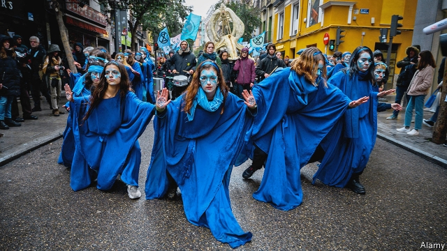

###### Climate change

# The COP25 meeting on the climate yields little 

 

> print-edition iconPrint edition | Science and technology | Dec 18th 2019 

ANNUAL UN CLIMATE summits are never moments of unbridled optimism, but this year’s, held in Madrid and dubbed COP25, was particularly dispiriting. Its logo was a clock with its hands at a quarter to 12. Midnight duly passed on Friday December 13th—supposedly the summit’s last day, and then again on Saturday. Only on Sunday did delegates agree to weak and watered-down commitments to enact previously promised cuts in emissions of greenhouse gases. And they deferred until next year a decision on regulating a new international carbon market. 

In 2015, in Paris, nearly 200 countries promised to stop global warming before average temperatures rose by more than 1.5-2°C above pre-industrial levels. Most climate scientists, though, admit privately that there is little hope of this. A coalition of governments including the European Union therefore came to Madrid demanding a strongly worded final text that would urge all countries to promise in 2020 to cut emissions further and faster than agreed so far. That text failed to materialise. 

In fact, the real effort on this front came from Brussels, where the EU’s leaders, after some wrangling, committed themselves on December 12th to reducing emissions to “net zero” by 2050. This means any release of greenhouse gases thereafter will be balanced by the capture of such gases already in the atmosphere by, say, extra afforestation. The European Commission’s presidency has published a comprehensive and ambitious, if sometimes vague, proposal for measures that would achieve this goal. As part of it, an EU climate law enshrining the 2050 target will be put forward in the spring of 2020. 

Weak and watered-down commitments to enact cuts in emissions of greenhouse gases are nothing new. What COP25 is really likely to be remembered for, though, is a failure to deal with carbon markets. Plans for such markets go back to a scheme created by the Kyoto protocol, a treaty signed in 1992. An arcane technical clause in the Paris agreement then offered a framework for linking existing national or regional markets and thus creating a new global one that would be administered by the UN and offer access to countries that do not have their own. Delegates in Madrid drew up guidelines for environmentally sound trading principles for this putative market. What they did not make clear was how all this would connect with what Kyoto had already achieved. 

The Kyoto version of carbon markets, the Clean Development Mechanism (CDM), let rich countries buy carbon credits from poor countries for carbon-capturing projects that offset their emissions at home. Thousands of CDM projects were duly registered, but unknown numbers of credits were left unclaimed after their value crashed in 2012, because demand dried up as a result of rule changes within the EU. 

Some of the main participants in the CDM, chiefly Brazil, want these credits transferred to the Paris scheme. But doing so would flood that scheme with “hot air”: credits that no longer correspond to real, future reductions in emissions. 

Done well, international carbon markets could accelerate emissions cuts by drawing in private funds and helping money to flow faster to the cheapest opportunities. One analysis, by the Environmental Defence Fund, an advocacy group, found that they might, in theory, reduce the cost of meeting climate targets by between 59% and 79%, assuming most countries participated. If financial gains were reinvested in further climate action, cumulative emissions cuts between 2020 and 2035 might be double those currently on the table in national pledges under the Paris agreement. 

All this leaves a lot to do in 2020. Within the UN, technical work on carbon markets will resume in the new year, leading up to next year’s meeting, in Glasgow. Climate is also on the agenda at an EU-China summit scheduled for September. During his presidency, Barack Obama was able to work with China’s president, Xi Jinping, and break the stalemate that had previously existed between the world’s two largest emitters. With America set to pull out of the Paris agreement in November, perhaps the European Union can step into the gap.■ 

