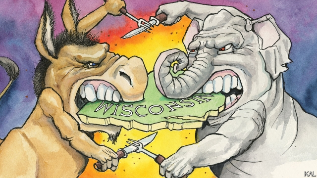

###### Lexington

# Fahrenheit Wisconsin 

 

> print-edition iconPrint edition | United States | Dec 18th 2019 

IT IS SOBERING to enter a school in middle America and find students and teachers frightened for their lives. It was also understandable that those at Wauwatosa East high school should feel this way when Lexington accompanied the local state representative, Robyn Vining, there. Eight high schools in Wisconsin had just experienced a real or suspected shooter incident in a three-day period. One in another school in Wauwatosa, a suburban area on the edge of Milwaukee, had led to its school cop shooting a pupil. 

“It happened there, it can happen here,” said one 16-year-old, at a meeting of Wauwatosa East’s Democratic Society. Several of the 25 students present said they avoided going to the bathroom in class time for fear of the school corridors. When asked who was scared to come to school, all raised their hands. So did their teacher. The blame the students attached to the conservative gun lobby for this catastrophe is one reason their society has 75 members and is growing. The school’s conservative club is defunct. 

The violence America’s gun fetish has wrought is polarising everywhere. Democrats consider unconscionable Republicans’ refusal to recognise that gun control makes schools safer; Republicans fear Democrats’ harping on the subject presages a wider assault on liberty. But in Wisconsin such partisan issues have become especially bitter. When the state’s Democratic governor, Tony Evers, called a special session of its Republican-led legislature in November to debate two gun controls—including a “red-flag” bill to help relatives report unhinged gun owners—the Republicans quashed it. The mutual suspicions such rows are giving rise to, seeping through the communities of a state once known for good governance and neighbourliness, make Wisconsin acutely illustrative of America’s broader political divide. 

That makes the state look like an augury of the political year ahead. So does the related fact that Wisconsin is especially likely to determine whether Donald Trump is re-elected. This is because, all else remaining equal, he needs to win only one of the three rust-belt states he took from the Democrats in 2016. And with Michigan and Pennsylvania looking fairly Democratic, he and his opponents have made Wisconsin, the whitest and most conservative of the trio, their priority. Last month the Democrats—who will hold their national convention in Milwaukee in July—knocked on 54,000 doors in the state in a weekend. Mr Trump’s campaign, which has fewer volunteers but more money, is meanwhile bombarding Wisconsinites with ads, including many lambasting his impeachment. Both parties say their activities in the state are eight months ahead of where they would normally be at this point in the cycle. 

Wisconsin’s rancorous politics are in part due to the tightness of its political contest—Mr Trump won the state by 0.7% of the vote. Democrats were shocked by that. But though Wisconsin had voted for their presidential candidates since 1984, in recent times only Barack Obama won convincingly. John Kerry and Al Gore both won Wisconsin by less than 1% of the vote. As elsewhere in the Midwest, the rightward shift this denoted was driven by working-class whites and flagging union membership. In 2011, Governor Scott Walker therefore pushed through legislation to smash collective bargaining. In the process he destroyed the Democrats’ main source of campaign finance and, his opponents believed, interparty fair play. That is another reason for the rancour. 

Republican voter-registration laws aimed at depressing Democratic turnout have caused more bad blood, on both sides. Wisconsin Democrats decry their opponents’ tactics; Wisconsin Republicans, without proof but with no less certainty, accuse the Democrats of what they themselves stand accused of. Encouraged by the state’s 81 talk-radio stations, many believe Mr Walker was beaten by Mr Evers last year because of electoral fraud by black voters in Milwaukee (for which there is no evidence). Meanwhile, following a court ruling this week, conservative activists appear to have succeeded in an effort to scrub 230,000 names from the electoral roll, mostly in Democratic areas. The fact that Democrats have more ground for complaint is at once provable and practicably immaterial, given how equally wronged both sides feel. 

There are three strands to the 2020 augury this offers. First, the state—and therefore the country—is likely to be close-run. With only 10% of Wisconsinites considered persuadable, there is no reason to expect a breakthrough for either party. And their base-rallying tactics make that even less likely. The Democrats are focusing on registering and turning out non-whites in Milwaukee, while eroding the Republicans’ grip on suburban areas such as Waukesha, where Mr Trump is not loved. The president’s campaign is trying to boost his support further among working-class whites. Wisconsin will be an election for partisans—and therefore nasty. 

The early campaigning is already raising tensions in the state. At the weekly gathering of an anti-Trump group known as the PerSisters—a stone’s throw from Wauwatosa East—its middle-aged activists said they no longer shared Thanksgiving and Christmas with pro-Trump relatives: politics was too fraught. “In their violent hatred of the president, the Democrats have raised the bar in terms of potential violence and nervousness in the state,” claimed Terry Dittrich, the Republican chairman in nearby Waukesha county. 

The third warning from Wisconsin is that the social damage done by such partisan enmity may be long-lasting. Almost worse than their fear was the desperation the kids at Wauwatosa East expressed at the mess their elders were making of their state and country. “You deserve not to be terrified,” lamented Ms Vining, who narrowly won Mr Walker’s old Wauwatosa seat last year in one of the Democrats’ standout successes of the mid-terms. But she will do well to retain it. Although both parties dream of Wisconsin moving towards them, America’s most contested state looks stuck, between their respective anger and fears, for some time yet.■ 

